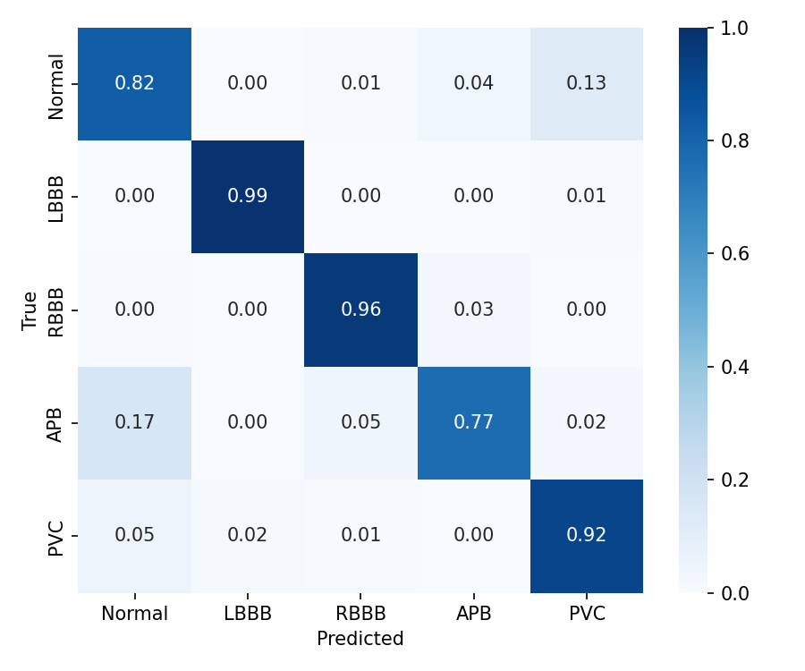
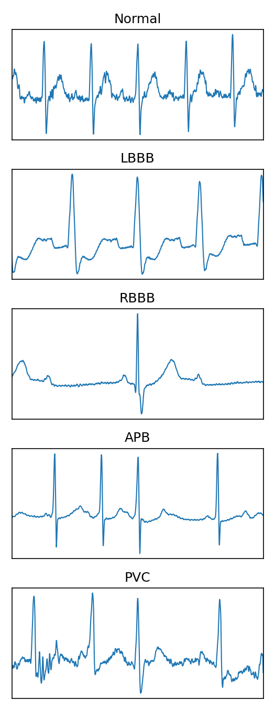
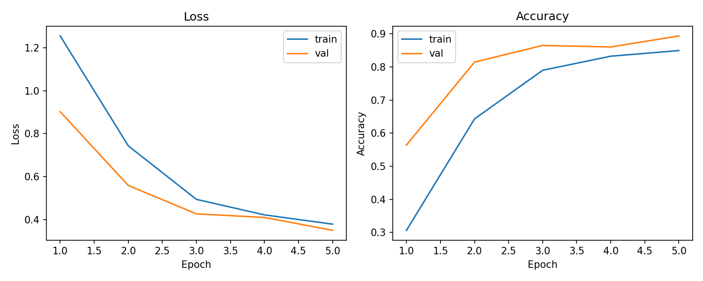

# Automated diagnosis of arrhythmia using CNN and LSTM

Automatic diagnosis of arrhythmia using a hybrid Convolutional Neural Network (CNN) + Long Short-Term Memory (LSTM) model that supports variable-length heartbeat segments.

**Badges:** add CI / coverage / license badges here

---

## Table of contents

- [Overview](#overview)
- [Quickstart](#quickstart)
- [Usage](#usage)
- [Data & Models](#data--models)
- [Development](#development)
- [Contributing](#contributing)
- [License & Citation](#license--citation)

---

## Overview

This repository implements an end-to-end pipeline for ECG arrhythmia classification. The core approach combines CNNs (for spatial/shape features) with LSTMs (for temporal context) and is designed to handle variable-length heartbeat segments.

Primary components:

- `src/` — library code (data loaders, preprocessing, model architecture, training, metrics)
- `scripts/` — CLI entrypoints (`train.py`, `infer.py`, utility scripts)
- `notebooks/` — demo and reproducibility notebooks
- `data/`, `models/`, `runs/`, `logs/` — runtime artifacts (ignored from git)

## Quickstart

Recommended: use a virtual environment and install dependencies.

```powershell
python -m venv .venv
.\\.venv\\Scripts\\Activate.ps1
pip install -r requirements.txt
```

If you have a CPU-only environment, consider installing `tensorflow-cpu` instead of `tensorflow`.

## Usage

Train (example):

```powershell
python scripts/train.py --kfolds 10 --epochs 30 --batch-size 128 --patience 5 --lr 1e-3
```

This will run training, save checkpoints to `runs/` (or `models/` depending on config), and produce TensorBoard logs under `logs/tensorboard/`.

View logs:

```powershell
tensorboard --logdir .\\logs\\tensorboard
```

Inference (example):

```powershell
python scripts/infer.py --record-path data/mitdb/100 --model-path runs/mitdb/best_model.keras --out logs/pred_100.csv
```

Check `notebooks/01_demo.ipynb` for an end-to-end demonstration.

## Data & Models

- Data: Place raw datasets under `data/` (e.g., `data/mitdb/`). The repository's `.gitignore` is configured to avoid committing dataset files. Do not push raw patient data to GitHub.
- Models & artifacts: Trained weights, checkpoints, and evaluation artifacts live in `models/`, `runs/`, or `artifacts/`. Use external storage (S3, Google Drive, or an artifact registry) for sharing large files.

## Development

- Run tests:

```powershell
pytest -q
```

- Lint/format: follow `pyproject.toml` / pre-commit hooks if present.

## Contributing

Contributions are welcome. Suggested workflow:

1. Fork the repository and create a feature branch
2. Add tests for new functionality
3. Open a pull request with a clear description and reproducible steps

Contributions and contact

Maintainer: `@Xornyv3`

Contributions, issues and questions are welcome — please open an issue or pull request in this repository. For large data or model files, provide external download links and include small helper scripts under `scripts/` to retrieve them.

This project is provided free for public use and modification. Contributions and collaborations are warmly welcomed; please open issues or pull requests on GitHub to get in touch.

## License & Citation

- License: this project is offered free for use and modification. If you require an explicit license file (for example, `LICENSE` with MIT/Apache terms), please raise an issue or submit a pull request.
- Data source: PhysioNet MIT-BIH Arrhythmia Database — cite per PhysioNet guidelines when publishing.

---

If you want, I can also:

- add CI badges and a short demo GIF to the top of this `README.md`
- commit this change for you
- create a `CONTRIBUTING.md` or `CODE_OF_CONDUCT.md`

Files touched: `README.md`

## Results (aggregate)

Below are the aggregate evaluation metrics computed across 10 stratified folds. For full interactive report and downloadable artifacts see `ecg-arrhythmia-cnnlstm/web-static/index.html`.

An interactive public report (figures, tables and downloadable artifacts) is also published and can be viewed at: https://automated-diagnosis-of-arrhythmia.netlify.app/.

| Class  | Precision (PPV) | Recall (Sensitivity) | Specificity | F1    | Support |
|--------|-----------------:|---------------------:|------------:|:-----:|-------:|
| Normal | 0.9861           | 0.8231               | 0.9669      | 0.8942| 7505   |
| LBBB   | 0.9541           | 0.9863               | 0.9957      | 0.9695| 807    |
| RBBB   | 0.9212           | 0.9596               | 0.9931      | 0.9385| 725    |
| APB    | 0.4127           | 0.7663               | 0.9646      | 0.5186| 254    |
| PVC    | 0.4643           | 0.9194               | 0.8975      | 0.6053| 713    |

Aggregate accuracy (mean over folds): **0.8516**

### Confusion matrix & figures

Below we embed representative results and visualizations produced by the evaluation pipeline. Each figure includes a short explanation of what it shows, how to read it, and how it informs arrhythmia prediction.

### 1) Normalized confusion matrix (aggregate)



This row‑normalized confusion matrix aggregates predictions across validation folds. Rows correspond to the true class and columns to the predicted class; each row sums to 1. Diagonal cells show per‑class sensitivity (recall). Off‑diagonal cells reveal common confusions — for example, misclassification of APB as Normal or PVC as APB. Use this plot to identify which classes need more representative examples, targeted augmentation, or model tuning.

### 2) Representative beat examples (per class)



These example waveforms illustrate typical morphology for each class (Normal, LBBB, RBBB, APB, PVC). The CNN component learns morphological patterns such as QRS width, R‑peak amplitude and pre/post complexes; inspecting representative beats helps verify preprocessing (alignment, normalization) and whether class differences are visually separable.

### 3) Training curves (example fold)



Training and validation loss/accuracy plots for a representative fold. These curves diagnose learning behaviour: a small gap between training and validation accuracy suggests good generalization; persistent validation loss or diverging curves can indicate overfitting, class imbalance effects, or the need for stronger regularization / data augmentation. Use fold curves together with aggregate metrics to choose hyperparameter adjustments.

If you prefer different folds or additional figures embedded here (for instance aggregate training curves across folds), add the corresponding PNG files to `ecg-arrhythmia-cnnlstm/figures/` and they will appear in this report.

